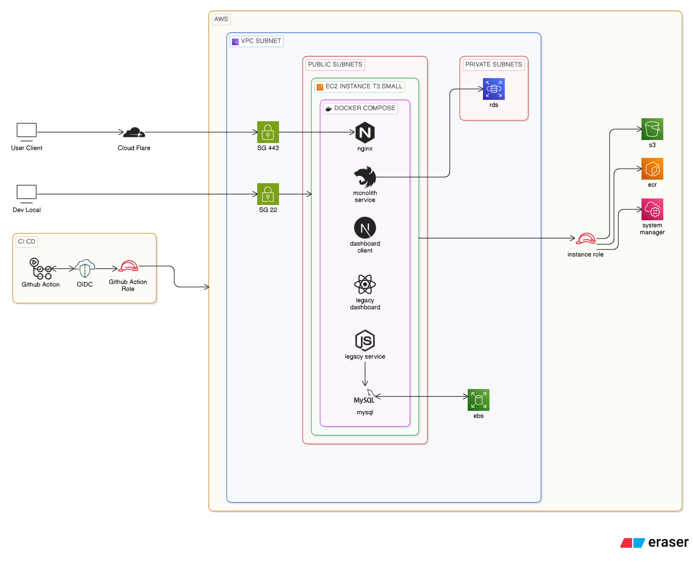

# 🛡️ Claim Outsourcing Management
**Strategic System Design & Cost-Aware Engineering**

Welcome to the documentation for **Claim OS**. This project isn't just a claims management system—it’s a deep dive into building an enterprise-grade environment on a strict budget, focusing on **"The Why"** behind every technical decision.

---

## 📖 The Story: Why This Project?
Managing insurance claims is a complex process involving multiple stakeholders, high data integrity requirements, and scalable workflows. I built **Claim OS** to demonstrate how to architect a production-ready system that is:
1.  **Maintainable**: Modular architecture that grows with the business.
2.  **Cost-Effective**: High performance on AWS without the "enterprise price tag."
3.  **Automated**: Continuous integration that eliminates manual errors.

### 🎯 Strategic Decisions (The "Why")
- **NestJS (API)**: Chosen for its modular architecture and built-in support for TypeScript, making the backend predictable and easy to scale.
- **Next.js (Frontend)**: Selected for its hybrid rendering (SSR/SSG), ensuring a fast, SEO-friendly experience for the dashboard and user-facing portals.
- **AWS EC2 over RDS/ECS**: For a cost-aware project, I opted for high-performance EC2 instances to host both the app and database (using Docker), significantly reducing the monthly burn compared to managed services while maintaining full control.
- **PostgreSQL & TypeORM**: Reliable data integrity for sensitive claim data, with an abstraction layer that allows for easier database migrations.
- **Cloudflare**: Integrated as the primary entry point to achieve zero-cost SSL/TLS termination and edge security (WAF/DDoS protection). This strategy bypasses the need for an expensive AWS ALB while providing a unified routing layer for both modern and legacy services.

---

## 🏛️ Architecture Decision Records (ADR)
I follow the ADR pattern to document significant architectural decisions. These records ensure that the logic behind my choices is preserved for the long term.

| Decision | Status | Rationale |
| :--- | :--- | :--- |
| **ADR 001: Modular Monolith (NestJS)** | ✅ Accepted | Balances simplicity and scalability without the overhead of microservices. |
| **ADR 002: EC2-First Infrastructure** | ✅ Accepted | Prioritized cost-efficiency by hosting core services on EC2 while offloading stateful data to managed storage where necessary. |
| **ADR 003: TypeORM for Data Persistence** | ✅ Accepted | Provides a robust abstraction over SQL while ensuring type safety across the stack. |
| **ADR 004: Using Cloudflare as Entry Point instead of AWS ALB** | ✅ Accepted | Optimized for zero-cost SSL termination and unified routing for both modern and legacy services. |
| **ADR 005: Infrastructure as Code via Terraform** | ✅ Accepted | Ensures predictable environment setup and simplifies resource management across AWS services. |

---

## 📊 System Architecture
The system is designed with a "Cost-Aware" mindset, utilizing a VPC with public and private subnets to ensure security while keeping the architecture lean.

---

## 🛠️ Implementation Deep Dive

### 🏢 Scaling with GitHub Organization
To mirror professional engineering environments, I moved the project into a dedicated **GitHub Organization**. 
- **Isolation**: Separating frontend, backend, and infrastructure repositories.
- **Shared Governance**: Centralized secrets and variables.

### 🚀 DevOps: GitHub Actions Workflows
I implemented end-to-end automation to ensure every commit is production-ready.
- **CI Pipeline**: Automated unit tests, linting, and security audits (Snyk/SonarQube).
- **CD Pipeline**: Automated deployment to AWS EC2 via SSH and Docker Compose, triggered only on successful merges to the `main` branch.
- **Environment Management**: Separation of `staging` and `production` environments using GitHub Environments and protected secrets.

### 💻 Technical Stack
- **Backend**: NestJS (API), TypeScript, JWT Auth, TypeORM.
- **Frontend**: Next.js, Tailwind CSS, React Hook Form, Shadcn UI.
- **Infrastructure**: AWS (VPC, Security Groups, EC2), Nginx (Reverse Proxy), Docker.

### 📂 Multi-Repo Structure (GitHub Organization)
This project is split into specialized repositories to follow the principle of Separation
- **monolithic-service**: Core backend logic (NestJS).
- **dashboard-client**: Frontend Admin & User interface (Next.js).
- **infra**: Infrastructure as Code (Terraform) managing VPC, EC2, Security Groups, and IAM Roles.
- **pipeline**: Content Delivery (CD).

---

## 💡 Key Learnings
Building **Claim OS** reinforced the importance of balancing technical purity with business constraints (cost and time). By documented ADRs and automating the pipeline, I created a system that is as much about **Engineering Excellence** as it is about **Strategic Value**.
